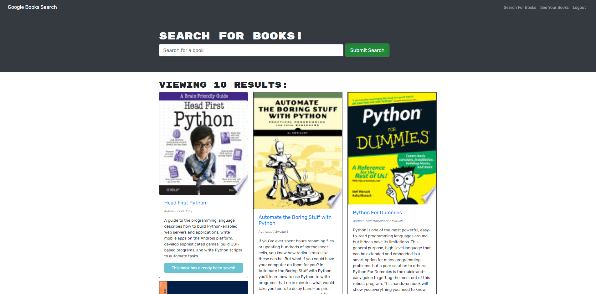
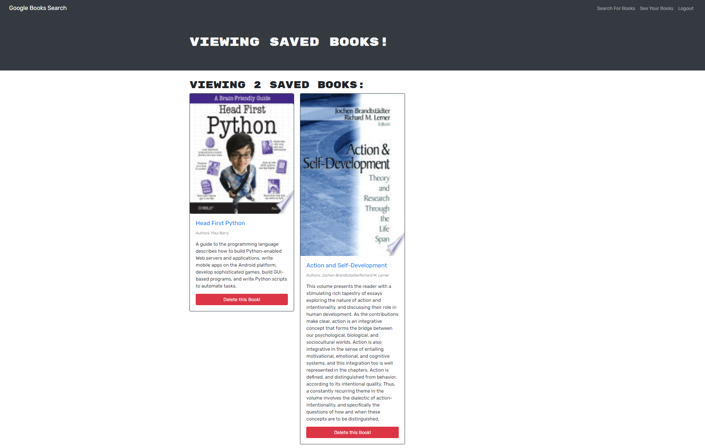
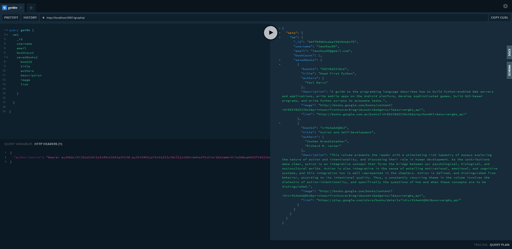

# Book Search Engine
You can view my React Portfolio here: [Book Search Engine](https://book-search-engine-lh.herokuapp.com/)

## Table of Contents

- [Description](#description)
- [Usage](#usage)
- [Credits](#credits)
- [Copyright](#copyright)
- [License](#license)
- [Features](#features)
- [Improvements](#improvements)
- [Tests](#tests)

## Description

This is the MERN Stack Book Search Engine Application that uses the Google Books API to fetch and respond data whenenver the user makes a search request. The user can sign up and login to save bookmarks on books for later reference.

## Technologies

Technologies used in this portfolio include:
 * HTML
 * CSS
 * JS/ES6
 * React
 * NodeJS and npm packages
    * Global
        * Run npm i concurrently beforenpm run install
    * Client
        * boostrap
        * graphql
        * jwt-decode
    * Server 
    * apollo-server-express version "^2.25.2"
        * The app won't work with the latest version due to how it handles middleware functions differently. Install version 2.x...
    * bcrypt
    * dotenv
    * express
    * jsonwebtoken
    * mongoose
    * nodemon

## Usage

My portfolio should look like this, please do not recreate or reuse under any circumstances without permission:

 
 
 

## Credits

Project developed by Leon Hsu. Copyright 2021 Leon Hsu leonhsu95. All Rights Reserved.

## Copyright

Copyright (c) [2021] [leonhsu95]

This work may not be reprinted, reproduced or reused under any circumstances.

## License

Copyright 2021 © Leon Hsu [leonhsu95](https://github.com/leonhsu95). All rights reserved.
Licensed under the [MIT](https://opensource.org/licenses/MIT).

Permission is hereby granted, free of charge, to any person obtaining a copy
of this software and associated documentation files (the "Software"), to deal
in the Software without restriction, including without limitation the rights
to use, copy, modify, merge, publish, distribute, sublicense, and/or sell
copies of the Software, and to permit persons to whom the Software is
furnished to do so, subject to the following conditions:

The above copyright notice and this permission notice shall be included in all
copies or substantial portions of the Software.

THE SOFTWARE IS PROVIDED "AS IS", WITHOUT WARRANTY OF ANY KIND, EXPRESS OR
IMPLIED, INCLUDING BUT NOT LIMITED TO THE WARRANTIES OF MERCHANTABILITY,
FITNESS FOR A PARTICULAR PURPOSE AND NONINFRINGEMENT. IN NO EVENT SHALL THE
AUTHORS OR COPYRIGHT HOLDERS BE LIABLE FOR ANY CLAIM, DAMAGES OR OTHER
LIABILITY, WHETHER IN AN ACTION OF CONTRACT, TORT OR OTHERWISE, ARISING FROM,
OUT OF OR IN CONNECTION WITH THE SOFTWARE OR THE USE OR OTHER DEALINGS IN THE
SOFTWARE.

## Features
- Login and Logout Functionality and User Token stored in Localstorage to authorize logins and personal bookmarks
- Users can search books in the home page and click the button to save to bookmark
- Bookmarks can also be deleted, which is also updated simultaneously without loading

## Improvements
- Better Webpage styling

## Tests

Website is validated with [HTML Markup Validation Tool](https://validator.w3.org/), [CSS Validation Service](https://jigsaw.w3.org/css-validator/) and [JS Validation Service](https://jshint.com/). Optionally,  you can use [JWT.IO](https://jwt.io/) to check JWT tokens credential.
